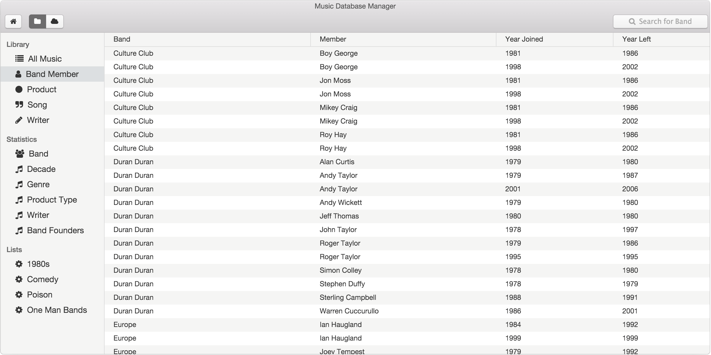

# Music Database Manager
Music database management application connected to a MySql database. 


> Created with AngularJS, Electron and PhotonKit.

## Dependencies

The application's build process depends on the following:

* [Node v6.9.5](https://nodejs.org/en/blog/release/v6.9.5/)
* [Bower](https://bower.io)
* [Gulp](http://gulpjs.com)

Node must first be installed with the installer, as found on its website linked above.

Bower and gulp can be installed with nodejs:
```bash
    npm install bower -g
    npm install gulp -g
```

## Getting Started
 This cross-platform desktop application was built with [Angularjs](https://angularjs.org) and packaged using [Electron](https://electron.atom.io).

 The user should specify their database credentials inside the connection object found in the databaseService file.

### Install

Install project dependencies

```bash
    # cd path/to/musicdb
    npm install
    bower install
```

Install application dependencies


```bash
    cd app
    npm install
```


### Run

Run the application for development

```bash
    # cd path/to/musicdb
    gulp
```

### Release

Generate an executable release installer

```bash
    gulp build-electron
```
